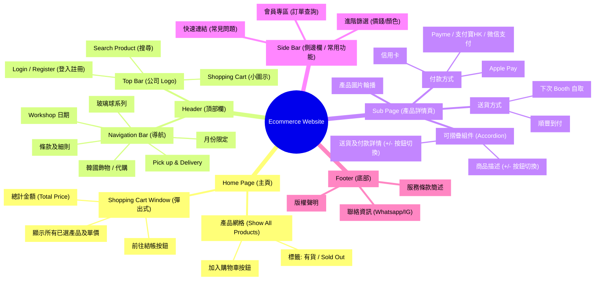
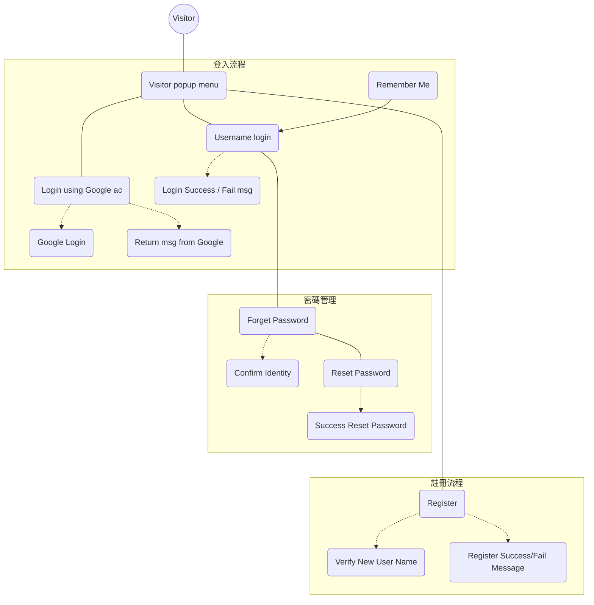
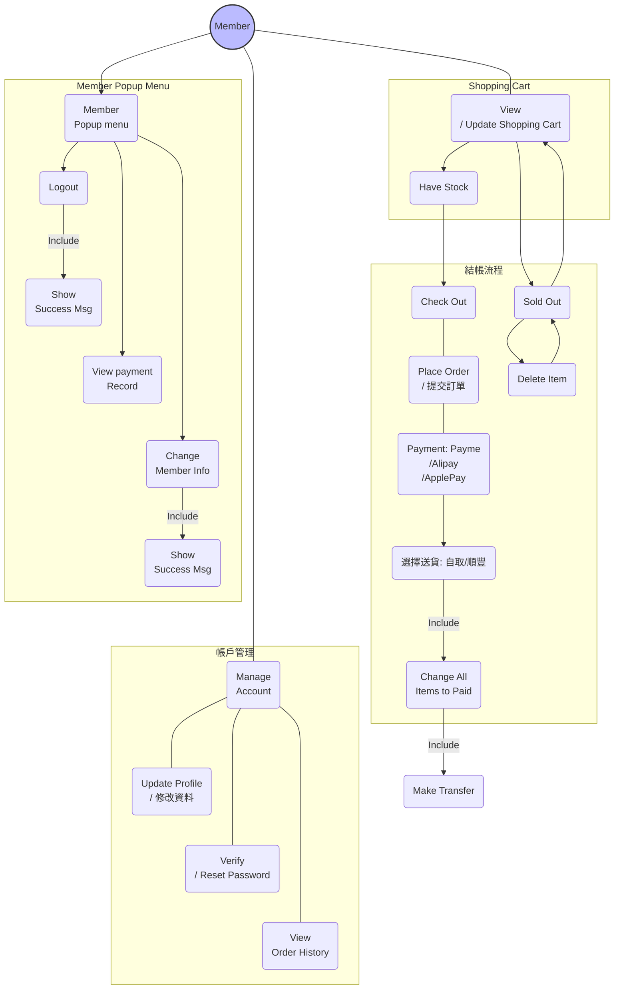
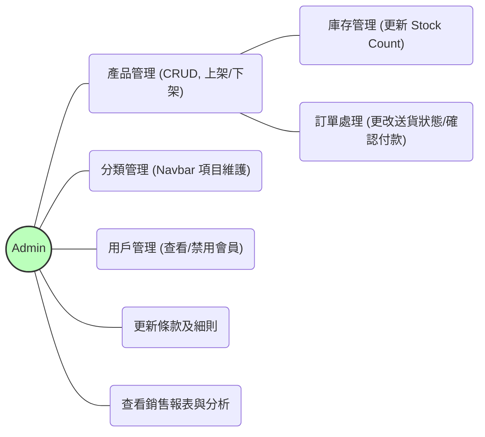
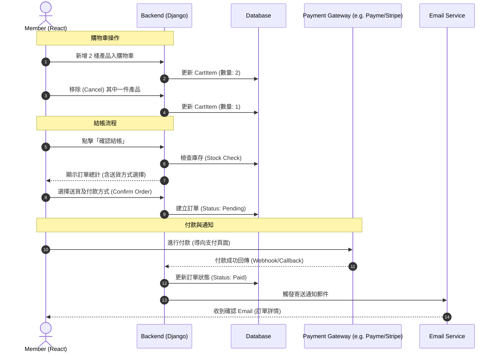
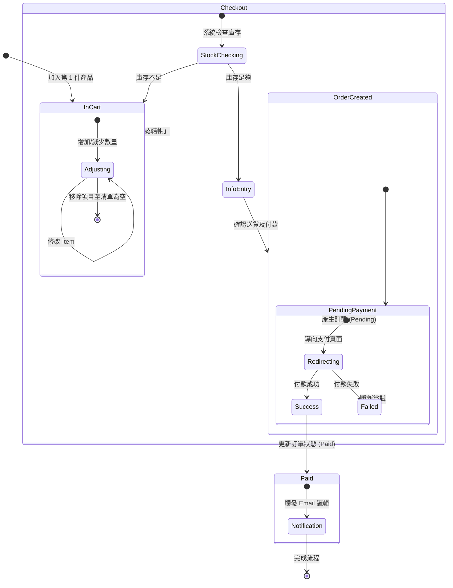
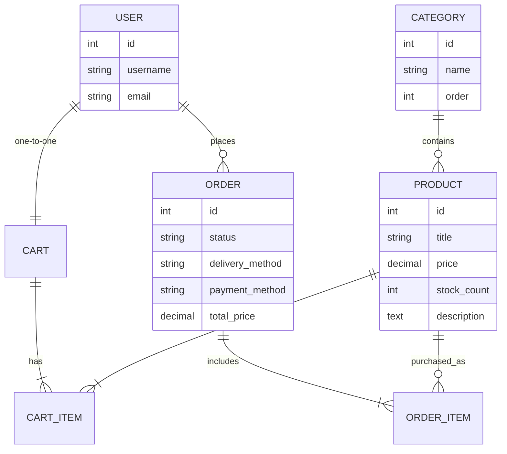

---

---



---



---

---



---

## Add item in Shopping Cart :



---



---

---

```python
STATUS_CHOICES = (
    ('pending', 'Pending Payment'),
    ('paid', 'Paid'),
    ('shipped', 'Shipped'),
    ('canceled', 'Canceled'),
)
status = models.CharField(choices=STATUS_CHOICES, default='pending')
```

---


