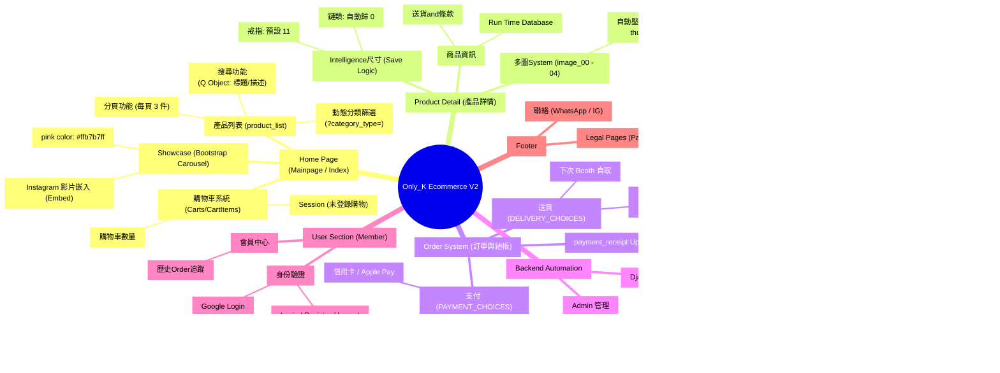

---

### User Authentication Flow :

---

### 結帳流程 與 帳戶管理 :

---

### Admin（管理員）流程圖:

---

### FrontEnd User Flow

---

## Add item in Shopping Cart (sequenceDiagram):

---

### Order State Diagram :

---

